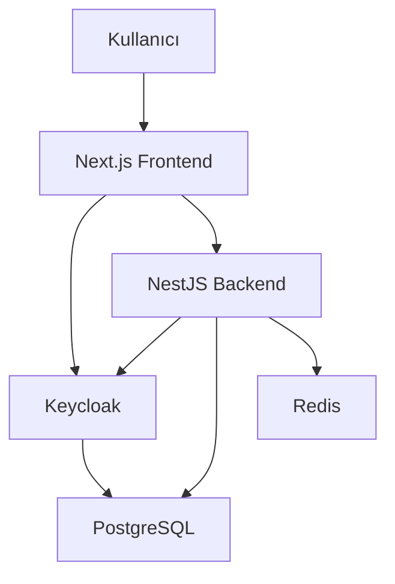

# 🔐 İş Güvenliği Sistemi

Keycloak, Next.js, NestJS ve PostgreSQL ile geliştirilmiş kapsamlı iş güvenliği yönetim sistemi.

## ✨ Özellikler

### 🔑 Kimlik Doğrulama & Yetkilendirme
- **Keycloak** ile merkezi kimlik yönetimi
- **Google** ve **Microsoft** sosyal giriş desteği
- **Çoklu oturum (Multi-Session)** yönetimi
- **Role-based** erişim kontrolü (RBAC)
- **JWT** token tabanlı güvenlik

### 👥 Kullanıcı Yönetimi
- Admin, Manager, Safety Officer, Employee rolleri
- Grup tabanlı yetkilendirme
- Kullanıcı profil yönetimi
- Oturum izleme ve yönetimi

### 🏢 İş Güvenliği Modülleri
- Güvenlik kayıtları yönetimi
- Eğitim takip sistemi
- Denetim logları
- Kaza ve olay raporlama

### 🛠️ Teknik Özellikler
- **Docker** ile konteynerize edilmiş mimari
- **PostgreSQL** veritabanı
- **Redis** cache sistemi
- **Swagger** API dokümantasyonu
- **TypeScript** ile tip güvenliği

## 🚀 Hızlı Başlangıç

### Gereksinimler
- Docker & Docker Compose
- Node.js 18+ (geliştirme için)
- Make (opsiyonel)

### 1. İlk Kurulum
```bash
# Projeyi klonlayın
git clone <repository-url>
cd IsGuvenligi

# Otomatik kurulum (önerilen)
make first-setup
```

### 2. Manuel Kurulum
```bash
# İzinleri düzeltin
chmod +x scripts/*.sh

# Servisleri başlatın
docker-compose up -d

# Sosyal giriş ayarları (opsiyonel)
./scripts/setup-social-login.sh
```

### 3. Erişim Bilgileri
- **Frontend**: http://localhost:3000
- **Backend API**: http://localhost:3001
- **API Docs**: http://localhost:3001/api
- **Keycloak**: http://localhost:8080
- **Admin Panel**: http://localhost:8080/admin/

### 4. Varsayılan Giriş Bilgileri
- **Sistem Admin**: `admin` / `Admin123!`
- **Keycloak Admin**: `admin` / `admin123`

## 📁 Proje Yapısı

```
IsGuvenligi/
├── backend/                 # NestJS Backend
│   ├── src/
│   │   ├── auth/           # Kimlik doğrulama
│   │   ├── users/          # Kullanıcı yönetimi
│   │   ├── admin/          # Admin paneli
│   │   ├── safety/         # İş güvenliği modülleri
│   │   └── entities/       # Veritabanı entiteleri
│   └── Dockerfile.dev
├── frontend/               # Next.js Frontend
│   ├── src/
│   │   ├── app/           # App Router sayfaları
│   │   ├── components/    # React bileşenleri
│   │   ├── hooks/         # Custom hooks
│   │   ├── services/      # API servisleri
│   │   └── lib/           # Yardımcı kütüphaneler
│   └── Dockerfile.dev
├── keycloak/              # Keycloak yapılandırması
│   ├── realm-export.json # Realm tanımları
│   └── themes/           # Özel temalar
├── database/             # PostgreSQL yapılandırması
│   └── init.sql         # Başlangıç SQL scripti
├── scripts/             # Yönetim scriptleri
├── docker-compose.yml   # Docker servisleri
├── Makefile            # Proje yönetim komutları
└── README.md
```

## 🛠️ Geliştirme

### Makefile Komutları
```bash
make help           # Tüm komutları listele
make up             # Servisleri başlat
make down           # Servisleri durdur
make logs           # Logları görüntüle
make status         # Servis durumları
make clean          # Sistem temizliği
make test           # Testleri çalıştır
make lint           # Kod kalitesi kontrolü
make backup         # Veritabanı yedekle
make health         # Sağlık kontrolü
```

### Geliştirme Ortamı
```bash
# Backend geliştirme
cd backend
npm install
npm run start:dev

# Frontend geliştirme
cd frontend
npm install
npm run dev

# Veritabanı erişimi
make shell-postgres
```

## 🔧 Yapılandırma

### Environment Değişkenleri
`.env` dosyasını düzenleyerek sistemi yapılandırabilirsiniz:

```bash
# Veritabanı
DB_NAME=isguvenligi
DB_USER=admin
DB_PASSWORD=password123

# Keycloak
KEYCLOAK_ADMIN=admin
KEYCLOAK_ADMIN_PASSWORD=admin123
KEYCLOAK_REALM=isguvenligi

# Sosyal Giriş
GOOGLE_CLIENT_ID=your-google-client-id
GOOGLE_CLIENT_SECRET=your-google-client-secret
MICROSOFT_CLIENT_ID=your-microsoft-client-id
MICROSOFT_CLIENT_SECRET=your-microsoft-client-secret
```

### Sosyal Giriş Kurulumu

#### Google OAuth
1. [Google Cloud Console](https://console.cloud.google.com/) açın
2. Yeni proje oluşturun veya mevcut projeyi seçin
3. APIs & Services > Credentials > OAuth 2.0 Client IDs
4. Redirect URI: `http://localhost:8080/realms/isguvenligi/broker/google/endpoint`
5. `.env` dosyasında Client ID ve Secret güncelleyin

#### Microsoft OAuth
1. [Azure Portal](https://portal.azure.com/) açın
2. Azure Active Directory > App registrations
3. Yeni uygulama kaydı oluşturun
4. Redirect URI: `http://localhost:8080/realms/isguvenligi/broker/microsoft/endpoint`
5. Certificates & secrets bölümünden client secret oluşturun
6. `.env` dosyasında Application ID ve Secret güncelleyin

## 📊 Sistem Mimarisi



### Servisler
- **Frontend (Port 3000)**: Next.js 14, Material-UI, React Query
- **Backend (Port 3001)**: NestJS, TypeORM, Swagger
- **Keycloak (Port 8080)**: Kimlik doğrulama sunucusu
- **PostgreSQL (Port 5432)**: Ana veritabanı
- **Redis (Port 6379)**: Cache ve session store

## 🔒 Güvenlik

### Güvenlik Özellikleri
- JWT token tabanlı kimlik doğrulama
- HTTPS desteği (production)
- SQL injection koruması
- XSS koruması
- CSRF koruması
- Rate limiting
- Brute force koruması

### Roller ve İzinler
- **Admin**: Tam sistem erişimi
- **Manager**: Yönetim fonksiyonları
- **Safety Officer**: İş güvenliği uzmanı
- **Employee**: Temel kullanıcı erişimi

## 📈 İzleme ve Yönetim

### Loglar
```bash
# Tüm servis logları
make logs

# Spesifik servis logları
make logs-frontend
make logs-backend
make logs-keycloak
make logs-postgres
```

### Sağlık Kontrolü
```bash
make health       # Servislerin durumunu kontrol et
make status       # Container durumları
make monitor      # Kaynak kullanımı
```

### Yedekleme
```bash
# Veritabanı yedekle
make backup

# Yedekten geri yükle
make restore backup_dosyası.tar.gz
```

## 🧪 Test

### Test Çalıştırma
```bash
# Tüm testler
make test

# Backend testleri
make test-backend

# Frontend testleri  
make test-frontend

# E2E testleri
npm run test:e2e
```

### Kod Kalitesi
```bash
# Lint kontrolü
make lint

# Type checking
npm run type-check

# Test coverage
npm run test:coverage
```

## 🚧 Bilinen Sorunlar

### Port Çakışması
Eğer portlar kullanımda ise `docker-compose.yml` dosyasında port numaralarını değiştirin.

### Keycloak Başlatma Sorunu
Keycloak'ın tamamen başlaması 1-2 dakika sürebilir. Beklendikten sonra tekrar deneyin.

### Sosyal Giriş Sorunları
OAuth yapılandırması eksikse sosyal giriş butonları görünmeyecektir. `.env` dosyasını kontrol edin.

## 📞 Destek

### Sorun Bildirimi
1. [Issues](https://github.com/your-repo/issues) bölümünden sorun bildirebilirsiniz
2. Log dosyalarını ekleyerek daha hızlı çözüm alabilirsiniz
3. Reproduksiyon adımlarını detaylandırın

### Geliştirme
1. Fork yapın
2. Feature branch oluşturun (`git checkout -b feature/amazing-feature`)
3. Commit yapın (`git commit -m 'Add amazing feature'`)
4. Push yapın (`git push origin feature/amazing-feature`)
5. Pull Request oluşturun

## 📝 Değişiklik Geçmişi

### v1.0.0 (2024-01-XX)
- ✨ İlk sürüm
- 🔐 Keycloak entegrasyonu
- 👥 Çoklu oturum desteği
- 🏢 Temel iş güvenliği modülleri
- 📱 Responsive tasarım
- 🐳 Docker konteynerizasyonu

## 📄 Lisans

Bu proje MIT lisansı altında lisanslanmıştır. Detaylar için [LICENSE](LICENSE) dosyasına bakın.

## 🤝 Katkıda Bulunanlar

- **İş Güvenliği Ekibi** - İlk geliştirme
- **Topluluk Katkıları** - Özellik geliştirme ve hata düzeltmeleri

---

**Made with ❤️ for safer workplaces**

🌟 Bu projeyi beğendiyseniz yıldız vermeyi unutmayın!